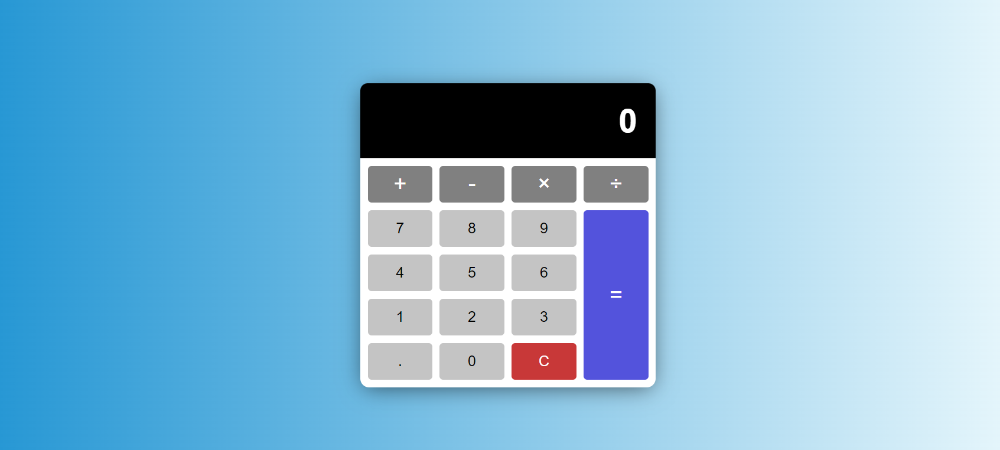

# JavaScript Calculator

This is a simple calculator built with HTML, CSS, and JavaScript. It performs basic arithmetic operations such as addition, subtraction, multiplication, and division.

## Demo

You can try the calculator online [here](https://osamaasasfeh.github.io/jsCalculator/).

## Features

- Addition
- Subtraction
- Multiplication
- Division
- Decimal point support
- Clear button to reset the calculator

## Screenshots

## Installation

To run the calculator locally, follow these steps:

1. Clone the repository to your local machine.
2. Open the `index.html` file in your web browser.

## Usage

To use the calculator, simply click the buttons or type on your keyboard to input the numbers and operators. The result will be displayed in the calculator's screen.

## Contributing

Contributions are welcome! If you would like to contribute to the project, please follow these guidelines:

1. Fork the repository and create a new branch.
2. Make your changes and test them.
3. Submit a pull request.

## License

This project is licensed under the [MIT License](https://opensource.org/licenses/MIT).
